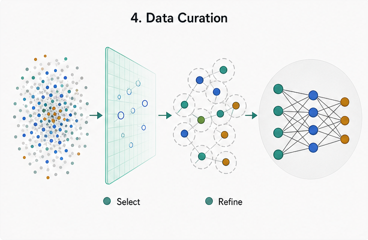
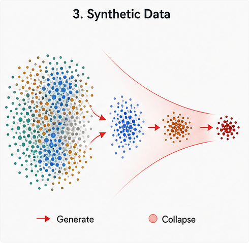
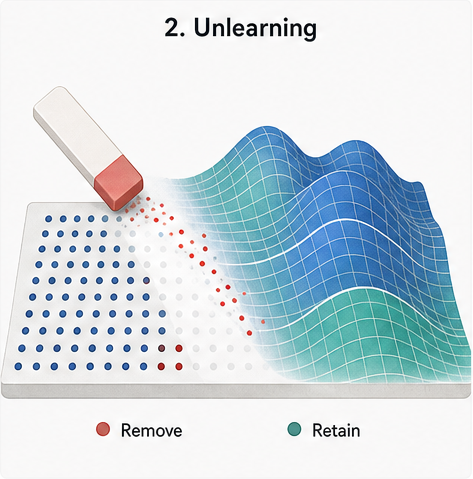
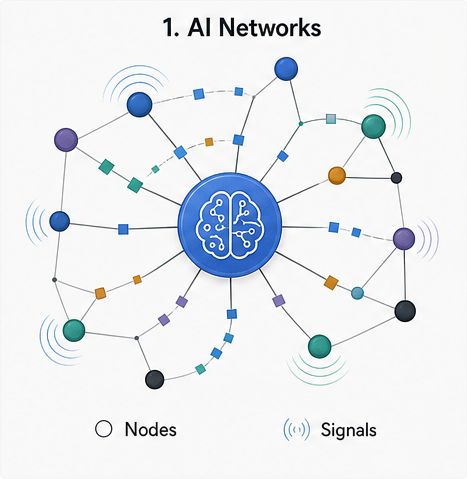

  

  # Xinbaopedia

  **One person. A growing map of ideas, papers, and research stories.**

  把个人主页、论文档案和研究脉络，变成一座真正可以探索的学术百科。

  
  
  

---

## 不只是另一份在线简历

传统个人主页告诉你一个人“做过什么”。Xinbaopedia 更想回答：**这些工作为什么重要，它们彼此有什么关系，下一步又会走向哪里？**

从一篇论文出发，可以继续走进它背后的研究问题；从一个研究方向出发，可以看到相关项目、合作、经历和成果。这里不是把履历铺成一张长网页，而是把散落的信息连接成一张能读、能搜、能继续追问的知识地图。

> 如果你是合作者、审稿人、学生，或只是对可信人工智能和数据研究感兴趣，这里能让你更快看懂 Xinbao Qiao 正在研究什么，以及这些研究值得关注的原因。

## 你可以在这里看到什么

| | 入口 | 你会得到什么 |
| --- | --- | --- |
| 👤 | [认识 Xinbao](https://xinbaopedia.top/wiki/Xinbao_Qiao/) | 学术背景、研究兴趣、教育经历与合作方向，一页快速看懂。 |
| 🧭 | [探索研究版图](https://xinbaopedia.top/wiki/Research/) | 不只罗列关键词，而是解释不同研究问题如何连成一条主线。 |
| 📚 | [浏览论文](https://xinbaopedia.top/wiki/Publications/) | 用容易理解的摘要、关键启示和图示快速抓住每项工作的价值。 |
| 💬 | [Chat with Xinbao](https://xinbaopedia.top) | 不知道从哪里开始？直接提问，让 AI 带你找到相关页面。 |
| 🌏 | [切换中文](https://xinbaopedia.top/wiki/Qiao_Xinbao_zh/) | 主要内容提供中英文入口，阅读和分享都更自然。 |

## 四条值得沿着走下去的研究线索

<table>
  <tr>
    <td width="25%" align="center">
      <a href="https://xinbaopedia.top/wiki/Data_Centric_Machine_Learning/">
        
         <strong>数据中心机器学习</strong>
      </a>
       当数据本身决定模型上限，怎样让它更可靠、更公平、更有用？
    </td>
    <td width="25%" align="center">
      <a href="https://xinbaopedia.top/wiki/Synthetic_Data/">
        
         <strong>合成数据</strong>
      </a>
       合成数据何时能扩大知识，何时又会让模型走向坍塌？
    </td>
    <td width="25%" align="center">
      <a href="https://xinbaopedia.top/wiki/Machine_Unlearning/">
        
         <strong>机器遗忘</strong>
      </a>
       当数据必须被删除，模型怎样真正忘记，同时保留能力？
    </td>
    <td width="25%" align="center">
      <a href="https://xinbaopedia.top/wiki/AI_and_Networks/">
        
         <strong>AI 与网络</strong>
      </a>
       在分布式、受限和互联环境中，如何让智能协作得更稳？
    </td>
  </tr>
</table>

## 为什么是“百科”，而不是“主页”

- **看见联系，而不只是列表。** 论文、概念、机构和经历彼此相连，读者可以顺着兴趣自然探索。
- **先讲意义，再讲术语。** 每个页面尽量回答“问题是什么、为什么值得解决、这项工作带来了什么”。
- **对第一次来的人友好。** 搜索、侧边导航、信息框和双语入口，让重要信息不需要翻找。
- **会继续生长。** 新论文、新合作和新想法进入后，会成为知识网络的一部分，而不是被埋在时间线里。
- **可以直接对话。** Chat with Xinbao 把公开内容变成一个可提问的入口，帮访客快速找到答案和出处。

## 从这里开始

第一次访问，推荐按这条路线走：

1. 先用一分钟阅读 [Xinbao Qiao 的个人条目](https://xinbaopedia.top/wiki/Xinbao_Qiao/)。
2. 再从 [Research](https://xinbaopedia.top/wiki/Research/) 选择一条感兴趣的研究线索。
3. 打开一篇论文，看它试图解决什么问题，以及关键启示是什么。
4. 如果仍有疑问，回到 [首页](https://xinbaopedia.top) 问 Chat with Xinbao。

### 准备好开始探索了吗？

[**打开 Xinbaopedia →**](https://xinbaopedia.top)

Wikipedia-inspired, independently built, and not affiliated with the Wikimedia Foundation.

