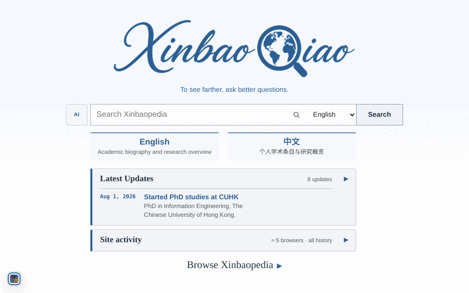
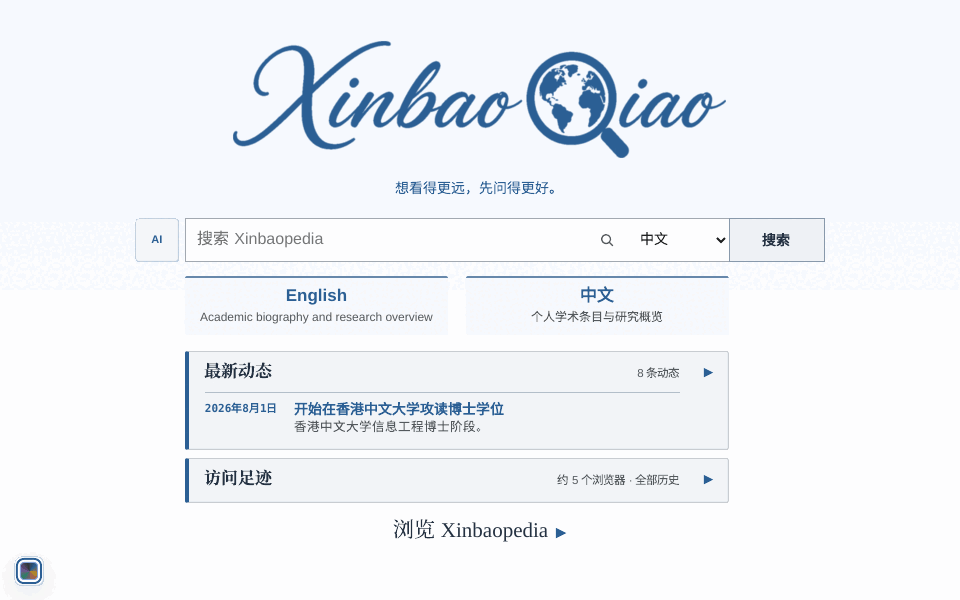

  
  

  

  # Xinbaopedia

  ## Research should be explorable.

  **A bilingual academic knowledge product for exploring people, papers, projects, institutions, and ideas — then asking questions with evidence in view.**

  Browse the connections. Search what you only half remember. Ask the Wiki. Trace grounded answers back to their sources.

  ### 研究不只应该被展示，更应该被探索。

  **一个连接人物、论文、项目、机构与概念的双语学术知识产品，让每一次搜索与追问都有证据可循。**

  浏览关联，搜索只记得大概的内容，向 Wiki 提问，再沿着证据继续探索。

  

    
    
  

  

    
    
    
  

---

## English

### See the product work

Discover on the homepage → follow the profile → open a publication → ask for a source-grounded answer.

## From profile page to knowledge product

A conventional academic homepage is an endpoint: a biography, a list of papers, a few links. Xinbaopedia turns the same material into a starting point — a connected place to browse, search, ask, and keep discovering.

**Readers see how the work fits together. Builders own the system that keeps it useful.**

<table>
  <tr>
    <td width="50%" valign="top">
      <strong>01 · EXPLORE</strong>
      <h3>A profile becomes a map</h3>
      Move through people, papers, projects, institutions, and concepts with real WikiLinks — not a flat CV timeline.
    </td>
    <td width="50%" valign="top">
      <strong>02 · DISCOVER</strong>
      <h3>Search follows intent</h3>
      Find ideas through English and Chinese titles, aliases, summaries, and natural phrasing — no exact filename required.
    </td>
  </tr>
  <tr>
    <td width="50%" valign="top">
      <strong>03 · ASK</strong>
      <h3>AI has to show its work</h3>
      Wiki-grounded answers cite the pages they used. Questions beyond the Wiki still receive a natural conversational response.
    </td>
    <td width="50%" valign="top">
      <strong>04 · SUSTAIN</strong>
      <h3>Launch is not the finish line</h3>
      Content checks, retrieval evaluation, live-model canaries, and production smoke protect quality after release.
    </td>
  </tr>
</table>

### Proof built into the product

<table>
  <tr>
    <td width="25%" align="center"><strong>2</strong> languages, one knowledge graph</td>
    <td width="25%" align="center"><strong>84</strong> public agent-readable concepts</td>
    <td width="25%" align="center"><strong>64</strong> bilingual retrieval test cases</td>
    <td width="25%" align="center"><strong>3</strong> grounded, conversational, protected modes</td>
  </tr>
</table>

## Designed around real questions

| When you want to… | The product… | So you get… |
| --- | --- | --- |
| Understand a research profile quickly | Organizes biography, education, papers, and themes as a bilingual Wiki | A clear reading path instead of a document to scan |
| Find an idea you only half remember | Searches titles, aliases, summaries, headings, and body text | Results closer to your intent |
| Ask “What did this paper contribute?” | Combines current-page context with related public evidence | A cited answer you can inspect |
| Ask beyond the Wiki | Switches to ordinary conversation instead of a canned refusal | A useful answer without invented Wiki sources |
| Build your own version | Opens the content model, maintainer, evaluations, and release gates | A reusable knowledge-product foundation |

<strong>Browse like a Wiki · Discover like search · Ask like an LLM · Verify like a researcher</strong>

Everything begins with one editable source of truth: <code>wiki/*.md</code>. Maintain the knowledge once; Xinbaopedia turns it into readable pages, connected navigation, search context, a knowledge graph, and an agent-readable bundle.

## Build your own Xinbaopedia

1. **Fork the system.** Keep the product UI, retrieval, maintenance, and release gates.
2. **Bring your knowledge.** Replace <code>wiki/*.md</code>, public media, and site metadata.
3. **Compile with confidence.** Regenerate knowledge artifacts, validate content and retrieval, then deploy.

~~~bash
npm ci
npm run maintain:wiki
npm run check
npm run build
~~~

After the production build, `npm run test:cube-geometry` verifies all three desktop reading faces against the Latest Updates track. Set `CUBE_GEOMETRY_BASE_URL` to reuse the same assertions against a deployed site. For an authorized publication, inject `GITHUB_TOKEN` and `VERCEL_TOKEN` through the operator's secret environment, run `npm run push:check`, then `npm run push:main` and `npm run release:production`; tokens never belong in command arguments or remotes.

<table>
  <tr>
    <td width="33%" valign="top"><strong>Content you can own</strong> Git-native bilingual Markdown that stays readable, reviewable, and portable.</td>
    <td width="33%" valign="top"><strong>Intelligence you can inspect</strong> Explicit retrieval, response policy, citation validation, and evaluation.</td>
    <td width="33%" valign="top"><strong>Operations you can trust</strong> Maintenance checks, immutable previews, live canaries, and production smoke.</td>
  </tr>
</table>

<strong>Repository map</strong>

~~~text
app/                     product pages, metadata and same-site API
components/              Wiki, search, theme and chat experiences
lib/                     parsing, retrieval, prompts and response policy
wiki/                    canonical bilingual knowledge
public/okf/              generated agent-readable knowledge bundle
evals/                   reviewed bilingual retrieval cases
scripts/                 maintenance, evaluation and release gates
docs/                    standards, deployment and chat operations
~~~

## Trust is a product feature

- **Evidence boundary:** grounded answers require validated citations; conversational replies cannot invent numbered Wiki sources.
- **Privacy boundary:** Xinbaopedia-owned Redis and logs do not store raw questions, chat history, raw IP addresses, original visitor coordinates, system prompts, private voice configuration, or API keys. The homepage activity map keeps only signed-browser HLL aggregates and quantized, thresholded map cells; the hosting platform still processes request IPs under its policies. The current chat message is still sent to the configured provider under its policies. See the [site-activity data contract](docs/site-activity/README.md).
- **Knowledge boundary:** hidden pages never enter public routes, OKF, or LLM retrieval.
- **Release boundary:** every production promotion must pass content, retrieval, grounded-answer, page-context, conversation, and sensitive-request canaries on an immutable preview.

<strong>Under the hood — frontend and LLM + Wiki backend</strong>

| Layer | Implementation | Product role |
| --- | --- | --- |
| Web and UI | [Next.js 15.5.20](https://nextjs.org/docs/15/app), [React 19.2.7](https://react.dev/), TypeScript | Static generation, responsive Wiki, search, themes, AI panel, and same-site API |
| Wiki rendering | react-markdown, GFM, KaTeX, WikiLinks | Articles, equations, tables, linked concepts, and missing-page hints |
| Knowledge source | Git-native Markdown + YAML frontmatter | Readable, diffable, reviewable canonical knowledge |
| Retrieval | Custom bilingual heading-level lexical retrieval | Stable section IDs, hashes, language filters, page weighting, and light graph expansion |
| LLM gateway | Server-side OpenAI-compatible Chat Completions | Production currently calls <code>deepseek-v4-flash</code> through Yunwu |
| Response policy | Grounded / conversational / protected router | Cited evidence, ordinary conversation, and deterministic sensitive-request blocking |
| Citation guard | Number validation, source compaction, one bounded retry | Invalid citations cannot reach the UI |
| State and export | Upstash Redis JS + OKF v0.1 Draft profile | Quota and retry state plus a portable human/agent-readable knowledge bundle |

The backend is not a wrapper around LangChain, LlamaIndex, Microsoft GraphRAG, or a vector database. Retrieval, routing, citation validation, evaluation, and maintenance are explicit repository code.

<strong>Standards, inspirations, and boundaries</strong>

- **Actually used:** [Next.js App Router](https://nextjs.org/docs/15/app), [React](https://react.dev/), and [GitHub Flavored Markdown](https://github.github.com/gfm/).
- **Specification basis:** [Open Knowledge Format v0.1 Draft](https://github.com/GoogleCloudPlatform/knowledge-catalog/blob/main/okf/SPEC.md), extended for bilingual retrieval and review.
- **Conceptual inspiration:** [Andrej Karpathy’s LLM Wiki](https://gist.github.com/karpathy/442a6bf555914893e9891c11519de94f).
- **Comparison references, not dependencies:** [MediaWiki](https://www.mediawiki.org/wiki/Manual:MediaWiki_architecture), [Microsoft GraphRAG](https://github.com/microsoft/graphrag), [LlamaIndex ingestion](https://developers.llamaindex.ai/python/framework/module_guides/loading/ingestion_pipeline/), [Ragas](https://docs.ragas.io/en/stable/concepts/metrics/available_metrics/), [OWASP LLM Top 10](https://genai.owasp.org/llm-top-10/), and [OpenTelemetry GenAI conventions](https://opentelemetry.io/docs/specs/semconv/gen-ai/).

See [Standards and conformance](docs/standards-and-conformance.md) for complete claim boundaries.

<strong>Continuous maintenance and release gates</strong>

<code>npm run check</code> validates types, WikiLinks, freshness, OKF, Wiki behavior, retrieval golden cases, and release scripts. GitHub Actions repeats checks and build; weekly maintenance reviews sources and bilingual retrieval; production verifies an immutable preview before promotion and runs real canaries on the canonical domain.

[Continuous maintenance](docs/continuous-maintenance.md) · [Relation taxonomy](docs/relation-taxonomy.md) · [Deployment troubleshooting](docs/deployment-troubleshooting.md) · [Chat backend](docs/chat/README.md)

## Licensing, contribution, and security

Software uses the [MIT License](LICENSE); licensable original Wiki and documentation text uses [CC BY 4.0](LICENSES/CC-BY-4.0.txt). Personal media and third-party assets are excluded from those blanket grants. See [Licensing](LICENSING.md), [Third-party notices](THIRD_PARTY_NOTICES.md), and [Asset provenance](ASSET_PROVENANCE.md).

Read [Contributing](CONTRIBUTING.md), the [Code of Conduct](CODE_OF_CONDUCT.md), and the private-reporting [Security policy](SECURITY.md).

<a href="#top">Back to top ↑</a>

---

## 简体中文

### 看见产品如何工作

从主页发现 → 沿人物页探索 → 打开研究页 → 获得可回查来源的 AI 回答。

## 从个人主页，到知识产品

传统学术主页通常是终点：一段简介、一列论文、几个链接。Xinbaopedia 把同样的材料变成探索的起点——可以沿关联浏览，可以按意图搜索，也可以带着证据继续追问。

**读者看到研究如何彼此关联，构建者掌握让它持续有用的整套系统。**

<table>
  <tr>
    <td width="50%" valign="top">
      <strong>01 · 探索</strong>
      <h3>个人主页变成知识地图</h3>
      人物、论文、项目、机构与概念通过真实 WikiLinks 相连，阅读不再停在平铺的履历时间线上。
    </td>
    <td width="50%" valign="top">
      <strong>02 · 发现</strong>
      <h3>搜索理解你的意图</h3>
      同时理解中英文标题、别名、摘要和自然表达，不要求你记住精确文件名。
    </td>
  </tr>
  <tr>
    <td width="50%" valign="top">
      <strong>03 · 追问</strong>
      <h3>AI 必须展示依据</h3>
      基于 Wiki 的回答引用真正使用过的页面；超出 Wiki 的问题仍会得到自然回答，而不是固定拒答。
    </td>
    <td width="50%" valign="top">
      <strong>04 · 持续</strong>
      <h3>上线不是终点</h3>
      内容检查、检索评测、真实模型 canary 与生产 smoke 共同守住上线后的长期质量。
    </td>
  </tr>
</table>

### 产品自带的证明

<table>
  <tr>
    <td width="25%" align="center"><strong>2</strong> 种语言，一张知识图谱</td>
    <td width="25%" align="center"><strong>84</strong> 个公开 agent-readable 概念</td>
    <td width="25%" align="center"><strong>64</strong> 条双语检索测试</td>
    <td width="25%" align="center"><strong>3</strong> 种模式：有据、对话、保护</td>
  </tr>
</table>

## 围绕真实问题设计

| 当你想要…… | 产品会…… | 于是你得到…… |
| --- | --- | --- |
| 快速理解一个人的研究 | 把人物、教育、论文与主题组织成双语 Wiki | 清晰的阅读路径，而不是一份需要扫读的文档 |
| 找到只记得大概的概念 | 检索标题、别名、摘要、小节与正文 | 更接近真实意图的结果 |
| 问“这篇论文做了什么？” | 结合当前页与相关公开证据 | 可以回查的引用回答 |
| 问 Wiki 尚未覆盖的问题 | 转入普通对话，而不是重复固定拒答 | 有用且不虚构 Wiki 来源的回答 |
| 构建自己的版本 | 开放内容模型、维护器、评测与发布门禁 | 可以复用的知识产品底座 |

<strong>像 Wiki 一样浏览 · 像搜索一样发现 · 像 LLM 一样对话 · 像研究者一样验证</strong>

一切从一份可编辑的可信知识源开始：只需维护 <code>wiki/*.md</code>，Xinbaopedia 就会把它转化为可阅读页面、关联导航、检索上下文、知识图谱和 agent-readable 知识包。

## 构建属于你的 Xinbaopedia

1. **Fork 整套系统。** 保留产品界面、检索、维护和发布门禁。
2. **带入你的知识。** 替换 <code>wiki/*.md</code>、公开媒体和站点 metadata。
3. **经过验证再发布。** 重新生成知识产物，检查内容与检索，然后部署。

~~~bash
npm ci
npm run maintain:wiki
npm run check
npm run build
~~~

生产构建完成后，`npm run test:cube-geometry` 会验证三个桌面阅读面是否与 Latest Updates 轨道一致；设置 `CUBE_GEOMETRY_BASE_URL` 后，同一组断言也可复验已部署站点。获得发布授权后，应通过运维环境安全注入 `GITHUB_TOKEN` 与 `VERCEL_TOKEN`，依次运行 `npm run push:check`、`npm run push:main` 和 `npm run release:production`；令牌不得出现在命令参数或远端地址中。

<table>
  <tr>
    <td width="33%" valign="top"><strong>你拥有的内容</strong> Git-native 双语 Markdown，可阅读、可审查、可迁移。</td>
    <td width="33%" valign="top"><strong>你看得懂的智能</strong> 显式实现检索、回答策略、引用验证与评测。</td>
    <td width="33%" valign="top"><strong>你可以信任的运维</strong> 维护检查、不可变预览、真实模型 canary 与生产 smoke。</td>
  </tr>
</table>

<strong>仓库结构</strong>

~~~text
app/                     产品页面、metadata 与同站 API
components/              Wiki、搜索、主题和 AI 交互
lib/                     解析、检索、提示词和回答策略
wiki/                    规范双语知识
public/okf/              生成的 agent-readable 知识包
evals/                   已审查的双语检索用例
scripts/                 维护、评测和发布门禁
docs/                    标准、部署和 AI 运维文档
~~~

## 可信本身就是产品能力

- **证据边界：** grounded 回答必须通过引用验证；普通对话不能虚构带编号的 Wiki 来源。
- **隐私边界：** Xinbaopedia 自有 Redis 与日志不保存原始问题、聊天历史、原始 IP、原始访客坐标、系统提示、私有语气配置或 API key。主页访问地图只保留签名浏览器的 HLL 聚合，以及经过量化和阈值保护的地图单元；托管平台仍会按其政策处理请求 IP。当前聊天消息仍会发送给配置的模型服务。详见[访问地图数据契约](docs/site-activity/README.md)。
- **知识边界：** 隐藏页不会进入公开路由、OKF 或 LLM 检索。
- **发布边界：** 每次 production promotion 前必须在 immutable preview 上通过完整 canary。

<strong>技术实现：前端与 LLM + Wiki 后端</strong>

| 层 | 实际实现 | 产品作用 |
| --- | --- | --- |
| Web 与 UI | [Next.js 15.5.20](https://nextjs.org/docs/15/app)、[React 19.2.7](https://react.dev/)、TypeScript | 静态生成、响应式 Wiki、搜索、主题、AI 面板与同站 API |
| Wiki 渲染 | react-markdown、GFM、KaTeX、WikiLinks | 文章、公式、表格、概念链接与缺失页提示 |
| 知识源 | Git-native Markdown + YAML frontmatter | 可读、可 diff、可审查的规范知识 |
| 检索 | 自研双语小节级词法检索 | 稳定小节 ID、哈希、语言过滤、当前页加权与轻量图扩展 |
| LLM gateway | 服务端 OpenAI-compatible Chat Completions | 生产环境目前经 Yunwu 调用 <code>deepseek-v4-flash</code> |
| 回答策略 | Grounded / conversational / protected router | 引用证据、普通对话与敏感请求确定性阻断 |
| 引用保护 | 编号验证、来源压缩、一次有界重试 | 无效引用不能进入 UI |
| 状态与导出 | Upstash Redis JS + OKF v0.1 Draft profile | 配额、重试状态与可迁移的人类/agent 知识包 |

这个后端不是 LangChain、LlamaIndex、Microsoft GraphRAG 或向量数据库的包装。检索、路由、引用验证、评测与维护都在仓库中显式实现。

<strong>标准、灵感与边界</strong>

- **实际使用：** [Next.js App Router](https://nextjs.org/docs/15/app)、[React](https://react.dev/) 与 [GitHub Flavored Markdown](https://github.github.com/gfm/)。
- **规范基础：** [Open Knowledge Format v0.1 Draft](https://github.com/GoogleCloudPlatform/knowledge-catalog/blob/main/okf/SPEC.md)，项目扩展了双语检索与 review 字段。
- **概念启发：** [Andrej Karpathy 的 LLM Wiki](https://gist.github.com/karpathy/442a6bf555914893e9891c11519de94f)。
- **对比参考而非依赖：** [MediaWiki](https://www.mediawiki.org/wiki/Manual:MediaWiki_architecture)、[Microsoft GraphRAG](https://github.com/microsoft/graphrag)、[LlamaIndex ingestion](https://developers.llamaindex.ai/python/framework/module_guides/loading/ingestion_pipeline/)、[Ragas](https://docs.ragas.io/en/stable/concepts/metrics/available_metrics/)、[OWASP LLM Top 10](https://genai.owasp.org/llm-top-10/) 与 [OpenTelemetry GenAI conventions](https://opentelemetry.io/docs/specs/semconv/gen-ai/)。

完整声明边界见 [Standards and conformance](docs/standards-and-conformance.md)。

<strong>持续维护与发布门禁</strong>

<code>npm run check</code> 验证类型、WikiLinks、新鲜度、OKF、Wiki 行为、检索 golden cases 与发布脚本。GitHub Actions 重复执行检查与构建；每周维护复核来源和双语检索；生产发布在 promotion 前验证 immutable preview，并在 canonical domain 上执行真实 canary。

[持续维护](docs/continuous-maintenance.md) · [关系分类](docs/relation-taxonomy.md) · [部署排障](docs/deployment-troubleshooting.md) · [AI 后端](docs/chat/README.md)

## 许可、贡献与安全

软件采用 [MIT License](LICENSE)；可授权的原创 Wiki 与文档文字采用 [CC BY 4.0](LICENSES/CC-BY-4.0.txt)。个人媒体与第三方素材不包含在上述统一授权中。详见 [Licensing](LICENSING.md)、[Third-party notices](THIRD_PARTY_NOTICES.md) 和 [Asset provenance](ASSET_PROVENANCE.md)。

参与项目前请阅读 [Contributing](CONTRIBUTING.md) 与 [Code of Conduct](CODE_OF_CONDUCT.md)；安全问题请通过 [Security policy](SECURITY.md) 私下报告。

<a href="#top">返回顶部 ↑</a>

---

## Explore Xinbaopedia · 进入 Xinbaopedia

Browse the Wiki, ask the evidence, or start building your own. · 浏览 Wiki、追问证据，或开始构建自己的知识产品。

